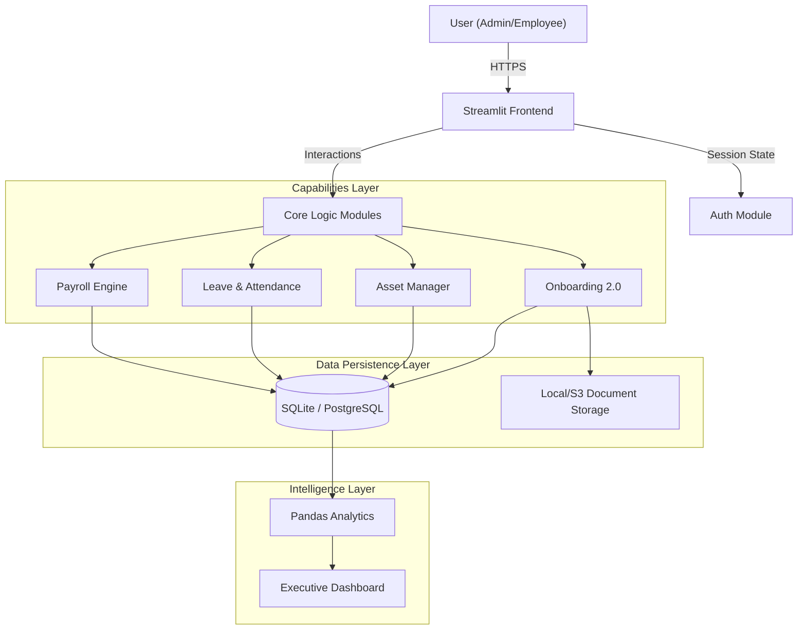
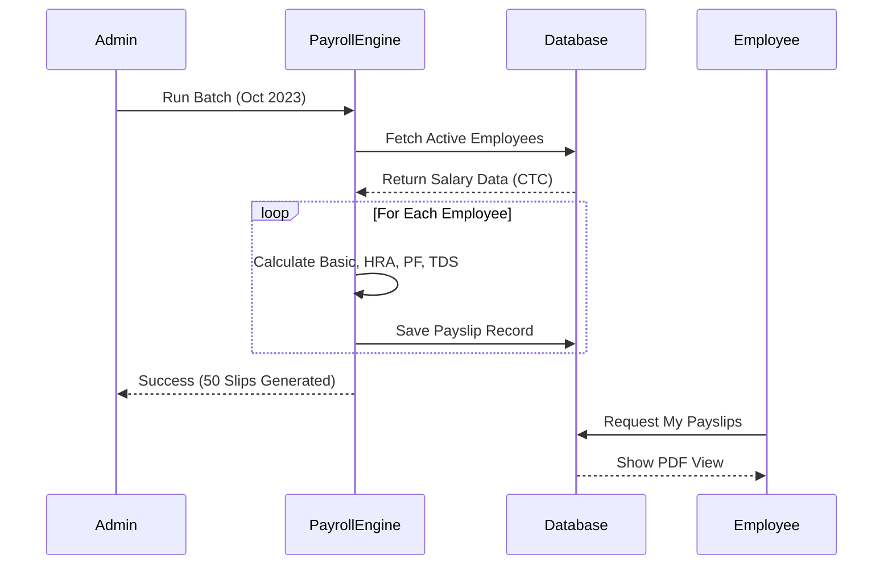

# 🧘 Zentara | Intelligent HRMS for India

> **Product of Hakim Sulthan Technologies**

**Zentara** is a modern, privacy-first Human Resource Management System (HRMS) built specifically for the **Indian Workforce**. Unlike bloated enterprise software, Zentara is lightweight, capable, and strictly compliant with Indian statutory requirements (PF, PT, TDS, Aadhaar, PAN).

---

## 🏗️ Architecture & Data Flow

Zentara follows a **Modular Monlithic Architecture** powered by Python. It allows for rapid development and easy integration with AI models.

### System Architecture


### Data Flow (Payroll Example)


---

## 🥊 Zentara vs The World

How does Zentara compare to **Workday** (Global Giant) or **Keka/GreytHR** (Indian Giants)?

| Feature | 🌍 Workday / SAP | 🇮🇳 Keka / GreytHR | 🧘 Zentara (Ours) |
| :--- | :--- | :--- | :--- |
| **Philosophy** | "Process Everything" | "SaaS for SMBs" | **"Privacy & Agility"** |
| **Data Privacy** | Cloud (US/EU Servers) | Cloud (AWS India) | **Self-Hosted (Your Data)** |
| **Cost** | $500k+ / Year | ₹100 / Emp / Month | **One-Time / Free OSS** |
| **Customization**| Impossible (Vendor Lock) | Limited | **100% Modifiable (Python)** |
| **AI Ready?** | Legacy Codebase | Closed System | **Native Python (AI-Ready)** |
| **Indian Laws** | Needs Customization | Native Support | **Native Support** |

**Why Zentara?**
*   **For Devs:** It's written in Python, the language of AI. You can plug in an LLM to "Chat with your Data" in minutes.
*   **For Companies:** No monthly recurring cost if self-hosted. Total control over employee data (No third-party snooping).

---

## 💰 Commercial Strategy: How much to charge?

If you are selling this as a solution, here is the recommended pricing model:

### 1. The SaaS Model (Managed Hosting)
*   **Target:** Small Business (<50 Employees).
*   **Price:** **₹3,000 / month flat** OR **₹60 / employee / month**.
*   **Value:** You handle functionality, backups, and uptime.

### 2. The Enterprise License (Source Code)
*   **Target:** Mid-Size Corp (50-500 Employees) who want internal control.
*   **Price:** **₹2,00,000 - ₹5,00,000 (One-time)**.
*   **Value:** They get the source code to host on their own intranet. They pay you 20% AMC (Annual Maintenance) for updates.

### 3. The Custom Dev Model
*   **Target:** Niche Industries (Factories, Hospitals).
*   **Price:** **₹1,500 / hour** for customization.
*   **Value:** Modifying Zentara to track "Shift Allowances" or "Hazard Pay".

---

## 🛠️ Developer Guide

### Prerequisites
*   Python 3.10+
*   Git

### Installation
```bash
# 1. Clone the repo
git clone https://github.com/zetaaztra/HRMS-HAKIM.git
cd HRMS-HAKIM

# 2. Install Dependencies
pip install -r requirements.txt

# 3. Initialize Database
python init_db.py

# 4. Run the App
streamlit run app.py
```

### Folder Structure
*   `app.py`: Main entry point & Router.
*   `modules/`: Business logic (Payroll, Auth, DB).
*   `hrms.db`: SQLite database (auto-created).
*   `assets/`: CSS and Images.

---

## 📜 License
Copyright © 2026 **Hakim Sulthan Technologies**. All Rights Reserved.
Commercial usage requires a license.
